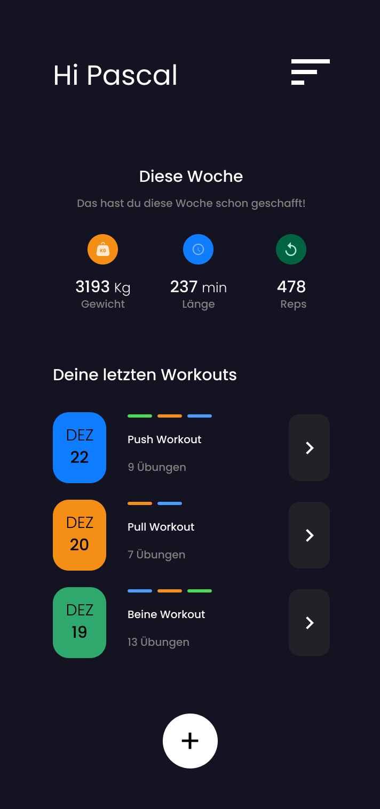
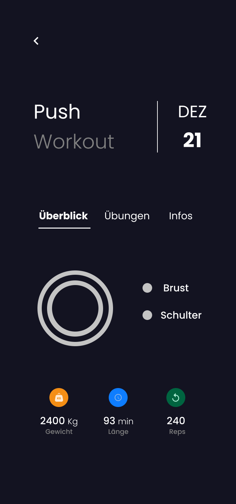
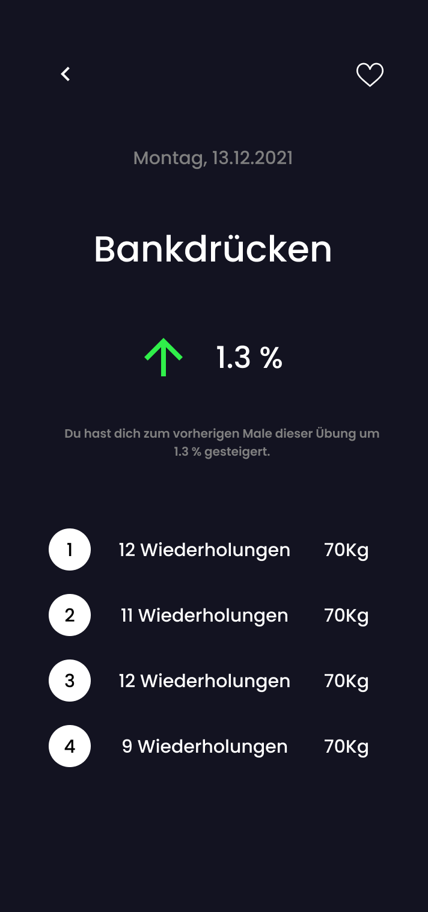

# Gym Tracker

Mobile Gym Tracker App using React Native + Firebase

## Technologies

- React Native (Javascript)
- Firebase Firestore (NoSQL Database)
- Firebase Authentication

## Screenshots

<!-- Screenshots -->
<div style="display: flex; justify-content: space-between;">
    
    
    
</div>

## Installation

1. Clone the repository:

   ```bash
   git clone https://github.com/your-username/FitnessApp.git
   ```

2. Navigate to the project directory:

   ```bash
   cd FitnessApp
   ```

3. Install dependencies:

   ```bash
   npm install
   ```

4. Create a Firebase Project:

   - Visit [Firebase Console](https://console.firebase.google.com/).
   - Click on "Add Project" and follow the setup instructions.

5. Set up Firebase Configuration using Environment Variables:

   - In the Firebase Console, go to Project Settings.
   - Under the "General" tab, find the Firebase SDK snippet.
   - Copy the relevant config values.

6. Create an Environment Variables File:

   - Create a file named `.env` in the project root.
   - Paste the copied config values into `.env`:

   ```
   REACT_APP_FIREBASE_API_KEY=your-api-key
   REACT_APP_FIREBASE_AUTH_DOMAIN=your-auth-domain
   REACT_APP_FIREBASE_DATABASE_URL=your-database-url
   REACT_APP_FIREBASE_PROJECT_ID=your-project-id
   REACT_APP_FIREBASE_STORAGE_BUCKET=your-storage-bucket
   REACT_APP_FIREBASE_MESSAGING_SENDER_ID=your-messaging-sender-id
   REACT_APP_FIREBASE_APP_ID=your-app-id
   ```

7. Start the Application Locally:

   ```bash
   npm start
   ```

8. Open the App on Android Emulator:
   - Ensure that an Android emulator is running.
   - Open the app using Expo CLI:
   ```bash
   npm run android
   ```

For more information on Firebase configuration and usage, refer to the [Firebase Documentation](https://firebase.google.com/docs/web/setup).
